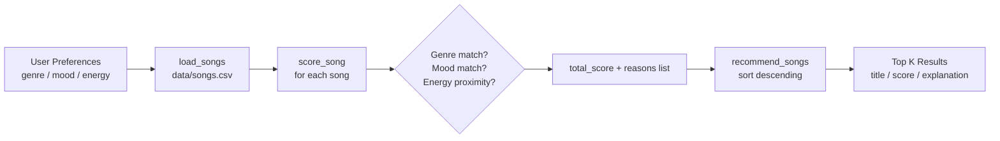
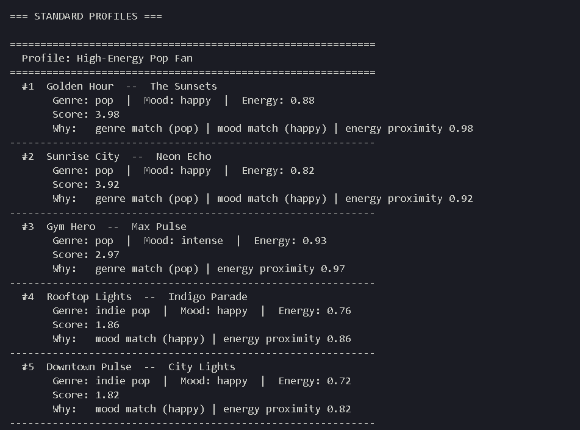

# Music Recommender Simulation

## Project Summary

VibeFinder 1.0 is a content-based music recommender simulation built for AI110 Module 4. It scores every song in a small catalog against a user's stated preferences (genre, mood, and energy level) and returns the top-ranked matches alongside plain-language explanations of why each was chosen.

---

## How The System Works

### Song features used

Each `Song` object carries these fields from `data/songs.csv`:

| Field | Type | Role in scoring |
| --- | --- | --- |
| `genre` | string | Primary match signal (+2.0 points) |
| `mood` | string | Secondary match signal (+1.0 point) |
| `energy` | float 0–1 | Proximity score (1.0 – \|target – song\|) |
| `tempo_bpm` | float | Stored; not currently scored |
| `valence` | float 0–1 | Stored; not currently scored |
| `danceability` | float 0–1 | Stored; not currently scored |
| `acousticness` | float 0–1 | Used in OOP `Recommender` for acoustic bonus |

### UserProfile fields

```python
UserProfile(
    favorite_genre="lofi",   # string — matched exactly against song.genre
    favorite_mood="chill",   # string — matched exactly against song.mood
    target_energy=0.35,      # float 0–1 — used for energy proximity scoring
    likes_acoustic=True,     # bool — awards +0.5 if song acousticness > 0.5
)
```

### Scoring rule

```text
score = 0.0
if song.genre == user.genre  →  score += 2.0   (genre match)
if song.mood  == user.mood   →  score += 1.0   (mood match)
score += 1.0 - |user.energy - song.energy|     (energy proximity)
```

Max possible score: **4.0** (genre + mood + perfect energy match).

### Ranking rule

All songs are scored individually, then sorted in descending order. The top `k` songs (default 5) are returned. Ranking is a list-level operation that depends on comparing every song's individual score against the others — it only makes sense once all songs have been scored.

---

## Data Flow



---

## Getting Started

### Setup

1. Create a virtual environment (optional but recommended):

   ```bash
   python -m venv .venv
   source .venv/bin/activate      # Mac / Linux
   .venv\Scripts\activate         # Windows
   ```

2. Install dependencies:

   ```bash
   pip install -r requirements.txt
   ```

3. Run the recommender:

   ```bash
   python -m src.main
   ```

### Running Tests

```bash
pytest
```

---

## Terminal Output

### Standard Profiles (High-Energy Pop, Chill Lofi, Deep Rock)



---

## Experiments

### Experiment 1 — Doubled energy weight

**Change:** `energy_score = 2.0 * (1.0 - energy_diff)` instead of `1.0 - energy_diff`

**Result for "Chill Lofi Listener" (lofi, chill, 0.35):**

| Rank | Song | Original score | Doubled-energy score |
| --- | --- | --- | --- |
| 1 | Library Rain (energy 0.35) | 4.00 | 5.00 |
| 2 | Empty Hallways (energy 0.30) | 3.95 | 4.90 |
| 3 | Midnight Coding (energy 0.42) | 3.93 | 4.86 |

Rankings stayed the same here because the top 3 are all genre+mood matches. However, for a profile where no genre match exists (e.g., "hip-hop"), doubling energy weight would promote songs whose only strength is energy proximity, pushing them above mood-matching songs — inflating energy's influence beyond what genre or mood provide.

**Takeaway:** Doubling energy weight causes the system to over-prioritize intensity over cultural fit. A user asking for "chill hip-hop" might receive high-energy ambient tracks simply because their energy targets align.

### Experiment 2 — Adversarial profiles (conflicting preferences)

Two edge-case profiles were tested:

**"High Energy + Chill Mood" (ambient, chill, 0.95):**
No song in the catalog has both high energy and a chill mood — ambient tracks are chill but low-energy (0.22–0.42). The system gives the mood bonus to chill songs but penalizes their energy heavily. Top result: Midnight Coding (score ~2.47) — a chill lofi song, not ambient — because the mood + partial energy score outweighs the genre bonus from an ambient song that has mismatched energy.

**"Unknown Genre: hip-hop" (hip-hop, happy, 0.8):**
No song earns the genre bonus (+2.0). Recommendations degrade to mood + energy only. Top result is Rooftop Lights (indie pop, happy, 0.76) — not hip-hop at all, but it matches mood and comes close on energy.

---

## Limitations and Bias

- **Genre over-weighting:** Genre accounts for up to 50% of the max score. A genre-matched song with the wrong mood will almost always outrank a mood-matched song of a different genre.
- **Filter bubble:** Content-based scoring recommends "more of the same." A pop fan will rarely discover jazz even if the energy and mood match perfectly.
- **No collaborative signal:** The system is blind to what other listeners enjoy. It cannot surface cross-genre gems (e.g., "jazz fans who also love certain ambient artists").
- **Cold-start for unknown genres:** If a user's preferred genre is not in the catalog, the genre bonus never fires and recommendation quality drops significantly.
- **Single-point preferences:** A user's energy preference is one number. Real listeners shift between moods — a morning study session and an evening workout need very different scores.

See [model_card.md](model_card.md) for the full bias and evaluation analysis.

---

## Reflection

Read and complete [model_card.md](model_card.md) and [reflection.md](reflection.md).

Building this recommender made the logic behind real platforms feel tangible. What Spotify does with millions of users and tracks is, at its core, the same weighted comparison — just with learned weights instead of hand-written rules, and collaborative signals layered on top of content features.

The most surprising finding was how quickly the genre weight created bias. Because genre is worth 2 points, the system confidently recommends a song with the wrong mood just because the genre matched. Real platforms spend enormous resources tuning these weights through live A/B tests — a reminder that recommender fairness is as much a design problem as a machine learning one.
